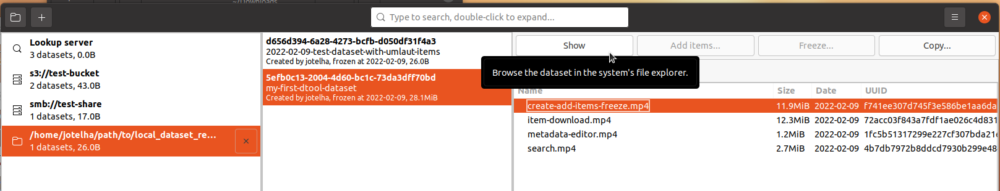

## Quick start

### Set-up

Navigate to https://github.com/IMTEK-Simulation/dtool-lookup-gui/releases and download the zip file with latest release of the dtool lookup gui for your OS (currently Windows and Linux offered).

Unpack the zip archive and launch the application. On a Linux machine, you will have to make the unpacked file executable first with

```bash
chmod +x dtool-lookup-gui
```

When you launch the GUI for the first time,
it may look quite empty:


Open the main menu by clicking the 'burger' menu in the upper right corner and select 'settings'.


Download the sample configuration for a testing server instance at
[`dtool.json`](../../samples/dtool-external.json)


Import it via the settings diaolog's 'import' icon


and selecting the downloaded file


This done, the imported settings will appear in the dialog


dtool uses cacheable tokens to facilitate authentication against the lookup server. Click on 'renew token' to fetch such a token. Authenticate with your username and password. 


In case of the testing configuration, it's 'testuser' and 'test_password'. The generated token appears in the settings dialog.


You won't have to authenticate again until the cached token looses its validity. 

After importing the configuration and closing the settings dialog, you will find these settings stored within `.config/dtool/dtool.json` below your user's home folder. The GUI will list two new 'base URIs' on the left-hand side: 


The prefix indicates the type of protocol used to communicate with the underlying storage infrastructure. 's3' points to s3-compatible object storage like [Amazon S3](https://en.wikipedia.org/wiki/Amazon_S3), '[smb](https://en.wikipedia.org/wiki/Server_Message_Block)' points to network storage familiar to many as Windows shares. The tesing server instance offers 's3://test-bucket' and 'smb://test-share' to play around with. Browse those locations by selecting them.


The first entry in the list plays a special role: Here you can see and search through all datasets that have been indexed by the lookup server:


In the central column you see the list of datasets. On the right-hand side you see a few buttons, the 'Details', 'Manifest' and 'Dependencies' tab, and below that fixed administrative and editable descriptive metadata. Latter is shown as [YAML](https://yaml.org/)-highlighted text. 

### Add a local base URI

Add a local folder to the list of base URIs by clicking the folder icon in the upper left corner:


and selecting the desired location


To disinguish them from other (remote) endpoints, local base URIs come with the 'file://' prefix.


### Copy a dataset from remote to local
Now, copy a dataset from a remote location to your local machine. Select a dataset on the s3-endpoint and download it via choosing your local folder from the 'copy'-button's drop-down menu:


The dataset will appear at your local base URI:

 template.


Adapt it to your needs in a text editor.

Open your `.config/dtool/dtool.json` in a text editor and point the `DTOOL_README_TEMPLATE_FPATH` entry to your `README.yml` template:


You might also want to configure your name and e-mail address.
That done, create a new dataset by selecting your local base URI and clicking the '+' icon in the upper left corner:


Pick a name


and notice the new entry in the list of datasets.


You see a new *UUID* in bold assigned to the freshly created dataset. This is an important concept. No matter how your dataset is stored,
how it's moved around, or how many copies of it are created, this *Universally Unique IDentifier* will stay 
with your dataset over its whole lifetime. No other dataset will ever own the same UUID. It hence serves as a [persistent identifier](https://en.wikipedia.org/wiki/Persistent_identifier), an important building block for implementing the [FAIR principles](https://doi.org/10.1038/sdata.2016.18) [^1].

The UUID is prefixed by an asterisk '*' to mark it as a 'ProtoDataset'. If configure correctly, the `README.yml` template should appear as descriptive metadata for the fresh dataset with some placeholders automatically filled in.

Enable the metadata editing switch at the bottom and fill in some more descriptive metadata in [YAML](https://yaml.org/) format.


Add items to your dataset,


and freeze it,


confirming the warning


Freezing means making the dataset immutable. The 'ProtoDataset' turns into a 'Datset', the askerisk mark disappears. It's now forbidden to alter the content. You may inspect the manifest


and explore the contents with your file system browser



### Structure of a dataset

The dataset's top level holds the `README.yml`, the `data` and the `.dtool` directories:


The `README.yml` just contains what you have entered as descriptive metadata in YAML-formatted text:


 
The `data` directory holds all items:


The `.dtool` directory contains administrative andstructural metadata distributed into several small files.


It is designed to be both machine-processible but also human-readible. For that purpose, it holds a `README.txt` describing the meaning of all items within:


Worth mentioning at this point is the `manifest.json`.


It holds size and checksums of all items at the point of freezing, making any illegal tempering with the items of the frozen dataset immediately noticeable.

For more information on the structure of a dataset, refer to the software authors' [publication](https://peerj.com/articles/6562/#) [^2].

Note that datasets on the testing storage locations used hera are 
**readable globally** by anyone, **not deletable** once deposited there, 
**not backed up**, and may disappear at any time.

[^1]: T. S. G. Olsson and M. Hartley, “Lightweight data management with dtool,” PeerJ, vol. 7, p. e6562, Mar. 2019, doi: [10.7717/peerj.6562](https://doi.org/10.7717/peerj.6562).

[^2]: M. D. Wilkinson et al., The FAIR Guiding Principles for scientific data management and stewardship, Scientific Data, vol. 3, no. 1, Art. no. 1, Mar. 2016, doi: [10.1038/sdata.2016.18](https://doi.org/10.1038/sdata.2016.18).

